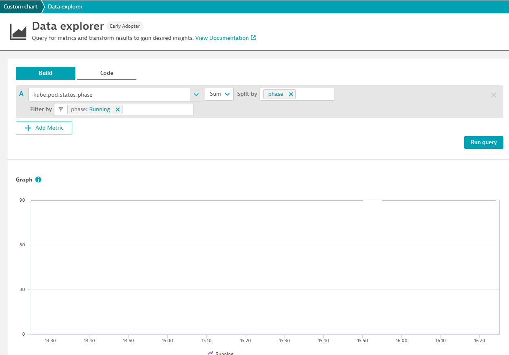

# Prometheus-k8s-Performance Clinic - Demo part 1


In this part of the demo, we will see how to configure your k8s service/pod to allow dynatrace to scrape the prometheus metrics.


## Step 0 : Let's deploy a new Prometheus exporter
Let's deploy a DaemonSet that allow us to collect eBpf metrics.
Our exemple will deploy :*
- the configmap : prometheus_exporter/dcstat.yaml
- prometheus_exporter/deployment.yaml with
    * DaemonSet
    * Service
    * ServiceMonitor

```
kubectl apply -f prometheus_exporter/dcstat.yaml
kubectl apply -f prometheus_exporter/deployment.yaml
```
In order to collec the prometheus metrics let's have access to the /metrics of the pod to confirm:
- ssl is not required
- the path is correct
- the port is correct
```
kubectl get pods 
```
result :

| NAME | READY | STATUS | RESTARTS | AGE |
| --- | --- | --- | --- |--- |
| alertmanager-prometheus-prometheus-oper-alertmanager-0|2/2|Running|0|12d|
| prometheus-grafana-76cbbd744f-mmjq4 | 2/2 | Running | 0 | 12d |
| prometheus-kube-state-metrics-95d956569-qq5jm | 1/1 | Running | 0 | 12d |
| prometheus-prometheus-node-exporter-4b4lv | 1/1 | Running | 0 | 12d | 
| prometheus-prometheus-node-exporter-9fcrk | 1/1 | Running | 0 | 12d |
| prometheus-prometheus-node-exporter-snxsm | 1/1 | Running | 0 | 12d |
| prometheus-prometheus-node-exporter-td856 | 1/1 | Running | 0 | 12d |
| prometheus-prometheus-oper-operator-6d9c4bdb9f-899pl | 2/2 | Running | 0 | 12d |
| prometheus-prometheus-prometheus-oper-prometheus-0 | 3/3 | Running | 1 | 12d |
| tracer-6cz9v | 1/1 | Running | 0| 12d |
| tracer-8qqsl | 1/1 |Running | 0 | 12d |
| tracer-9z9m9 | 1/1 | Running | 0 | 12d |
| tracer-hkb2s | 1/1 | Running | 0 | 12d |

Now let's configure a portforward :
for example
```
kubectl port-forward tracer-9z9m9 9435:9435
```
let's see that we have metrics exposed :
```
curl http://localhost:9435/metrics

```
## Step 1 : Let's modify the deployment to add dynatrace scraping annotations
Add the following annotations on the spec of the Daemonset :
```
metrics.dynatrace.com/port: '9435'
metrics.dynatrace.com/scrape: 'true'
metrics.dynatrace.com/path: '/metrics'
```
## Step 2 : let's focus on our usecase - collect kubestat metrics
In order to modify the deployment of prometheus, we are going to create a service
```
kind: Service
apiVersion: v1
metadata:
  name: kube-state-CLUSTERNAME_TOREPLACE
  annotations:
    metrics.dynatrace.com/port: '8080'
    metrics.dynatrace.com/scrape: 'true'
    metrics.dynatrace.com/path: '/metrics'
spec:
  ports:
    - name: dynatrace-monitoring-node-exporter-port
      port: 9220
  selector:
          app.kubernetes.io/name: kube-state-metrics
  clusterIP: None

```
Let's replace CLUSTER_TOREPLACE with the name of our cluser and deploy it
```
kubectl apply -t ../prometheus_exporter/service.yaml
```
## Step 3 : use the metric explorer to create a graph

