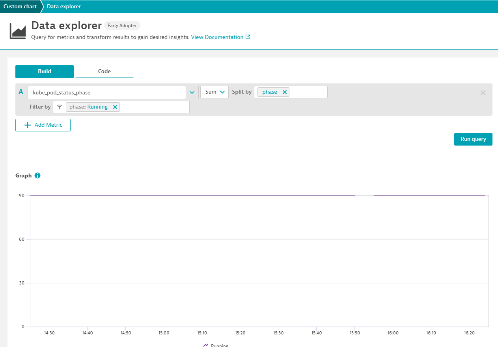

# Prometheus-k8s-Performance Clinic - Demo part 2


In this part of the demo, how to collect ressource usage of k8s with the help of Prometheus


## Step 0 : let's collect the node exporter metrics
In order to modify the deployment of prometheus, we are going to create a service
```
apiVersion: v1
kind: Service
metadata:
  annotations:
    metrics.dynatrace.com/path: /metrics
    metrics.dynatrace.com/port: "9100"
    metrics.dynatrace.com/scrape: "true"
  name: CLUSTERNAME_TOREPLACE-nodeexporter
spec:
  clusterIP: None
  ports:
    - name: dynatrace-monitoring-node-exporter-port
      port: 9220
  selector:
    app: prometheus-node-exporter

```
Let's replace CLUSTER_TOREPLACE with the name of our cluser and deploy it
```
kubectl apply -t ../prometheus_exporter/service_nodeexporter.yaml
```
## Step 1 : use the metric explorer to create a graph

## Step 2 : Let's create an anomaly detection rule
